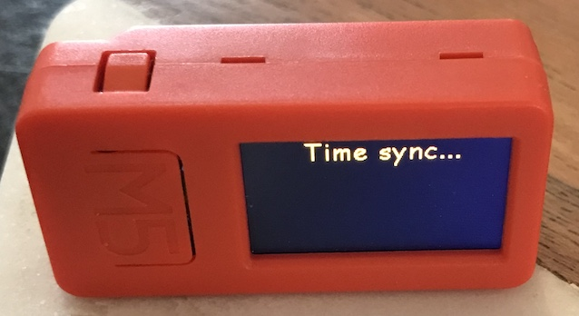
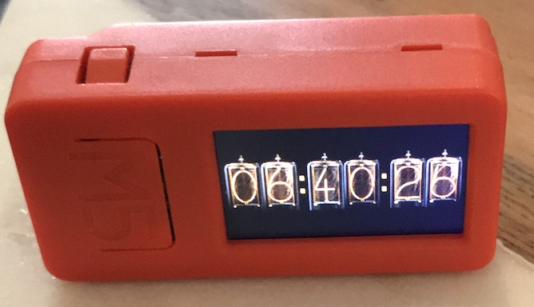
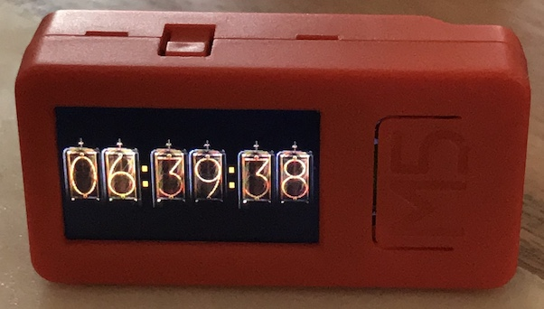
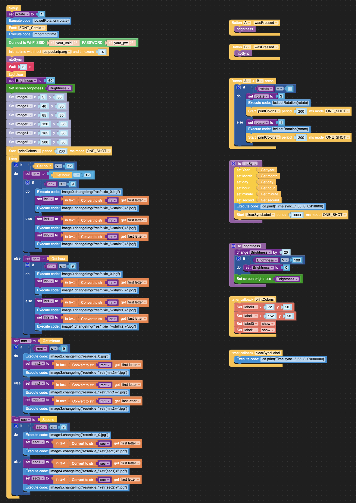

# M5StickC-Plus-Nixie-clock
A Nixie tube clock for the M5StackC-Plus programmed with uiFlow instead of Arduino.  All credit goes to Macsbug for the original implementation of the Nixie tube clock watch on the M5StickC device.

Source 1:  https://macsbug.wordpress.com/2019/06/06/m5stickc-nixie-tube-clock/

Source 2: https://community.m5stack.com/topic/1087/m5stickc-nixie-tube-clock

The nixie tube numerical images were copied from this repo and reformatted as jpg instead of png to make it compatible with the M5StickC-Plus device.
https://github.com/McOrts/M5StickC_Nixie_tube_Clock/tree/master/images

-----------------------------------------------------------------
### Objective
The objective of this project was to implement the Nixie tube clock using the M5Stack uiFlow Blockly IDE instead of the Arduino IDE. This makes it easier for kids and new programmers to understand the logical flow of programming without having to memorize complicated syntax. However, to understand what the syntax is "under the covers" of the flow, you can easily switch to the Python tab of the uiFlow IDE to see the MicroPython syntax.

-----------------------------------------------------------------

### Current Functionality
+ RTC (real time clock) synchronzied with NTP (network time protocol).
+ Adjustable screen brightness
+ Screen flip so you can have the device facing either horizontal direction

### Future Functionality (WIP)
+ Add a selectable configuration parameter for 12 or 24 hour clock
+ Add the date in nixie digits
+ Source additional nixie digits and symbols to implement other ideas (TBD)

-----------------------------------------------------------------

### Installation Instructions
1. Copy all the .jpg files in the images folder to the M5StickC Plus device using Adafruit ampy CLI tool (preferred), Thonny IDE, or Mu IDE and put them in the /flash/res directory
2. Using your browser (Chrome is preferred), go to the web uiFlow IDE at https://flow.m5stack.com
3. Open Nixie-clock.m5f using the menu in the upper right of the IDE
4. Set your WiFi SSID and password in the setup function
5. *Optional:* Set the NTP host and timezone offset for your location. The default is UTC-4.
6. Run the program (using the Play button) or Download the program (using the Download option in the IDE menu) to your M5StickC Plus device

-----------------------------------------------------------------

## Navigation Instructions
*NOTE:* There are 3 buttons on the M5StickC Plus. Power/Reset on the left side, Button A (labeled M5) on the front, and Button B on the right side.

After the program loads, the user is presented with a "Time sync..." notification and then the Nixie tube clock.

### Clock
  
  
  
+ Press Button A adjust the screen brightness, 0-100% in increments of 20%. The default power-on brightness is 60%.
+ Press Button B to sync with the NTP server if the time is for some reason not in sync
+ Press Button A and Button B simultaneously to flip the screen to the other horizontal orientation

-----------------------------------------------------------------

#### uiFlow

